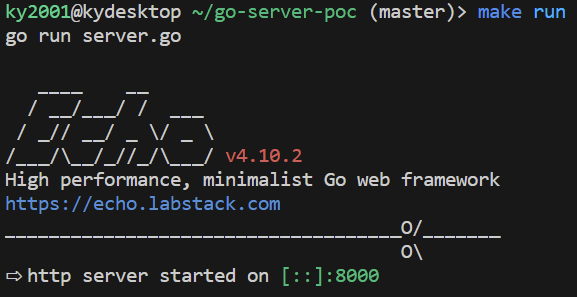

# go-server-poc
## What is this?
<strong>go-server-poc</strong> is a Proof of Concept (PoC) howcasing a simple web server built with [Golang](https://go.dev/). It can serve as a simple template for similar projects. The project uses [OpenAPI 3.0 (Swagger)](https://swagger.io/specification/), [oapi-codegen](https://github.com/deepmap/oapi-codegen) for schema driven development, and [echo](https://github.com/labstack/echo) as a web-framework. The PoC server is hosted on Google Cloud Run at the following endpoint: https://go-server-poc-2ra7djjztq-an.a.run.app/health.

 

## Getting Started
### Prerequisites
Before you begin, ensure that Docker and Golang are installed on your machine, and binary paths are appropriately exported. This guide is based on the assumption that you are using Linux or macOS.

### Start the server on local
1. Clone this repository:
```
git clone https://github.com/KY2001/go-server-poc
```
2. Start the server:
```
make run
```

### Host Swagger UI on local
1. To host Swagger UI, execute:
```
make compose-up
```
Then Swagger are Install and run as docker image.
2. Open your browser and navigate to http://localhost:3001/

### Develop New Endpoints
1. Add API definitions on `/openapi/openapi.yaml`
2. Generate necessary Go code using [oapi-codegen](https://github.com/deepmap/oapi-codegen):
```
make gen
```
This command generates `/openapi/server.gen.go` and `/openapi/types.gen.go`.

3. Write handlers in /handler/xxx.go and add the handler to /handler/handler.go as follows:
```
type Handler struct {
	GetHealthHandler
}

func NewHandlers() *Handler {
	return &Handler{
		GetHealthHandler: GetHealthHandler{},
	}
}
```

### Deploy on Google Cloud Run
1. Install Google Cloud SDK on your machine following the [manual](https://cloud.google.com/sdk/docs/install-sdk?hl=ja).
2. Build and upload the Docker image:
```
gcloud builds submit --tag asia.gcr.io/${GCP_PROJECT}/${IMAGE_NAME}
```
3. Deploy on Cloud Run
```
gcloud run deploy --image asia.gcr.io/${GCP_PROJECT}/${IMAGE_NAME} --platform managed
```

### Note
- Configuration parameters are managed in /config/config.go using [envconfig](https://github.com/kelseyhightower/envconfig).
- Useful commands are provided in the `/Makefile`.
- golangci-lint and tests are executed every time the code is pushed using [GitHub Actions](https://docs.github.com/en/actions). You can view the results [here](https://github.com/KY2001/go-server-poc/actions). For more details, please refer to `.github/workflows/golangci.yaml`.

### Necessary Considerations for Actual Development
- Determine the type of database to use (e.g., install xxSQL locally, use a cloud DB, or utilize file systems).
- Consider the appropriate directory structure (e.g., MVC, Clean Architecture, etc.).
